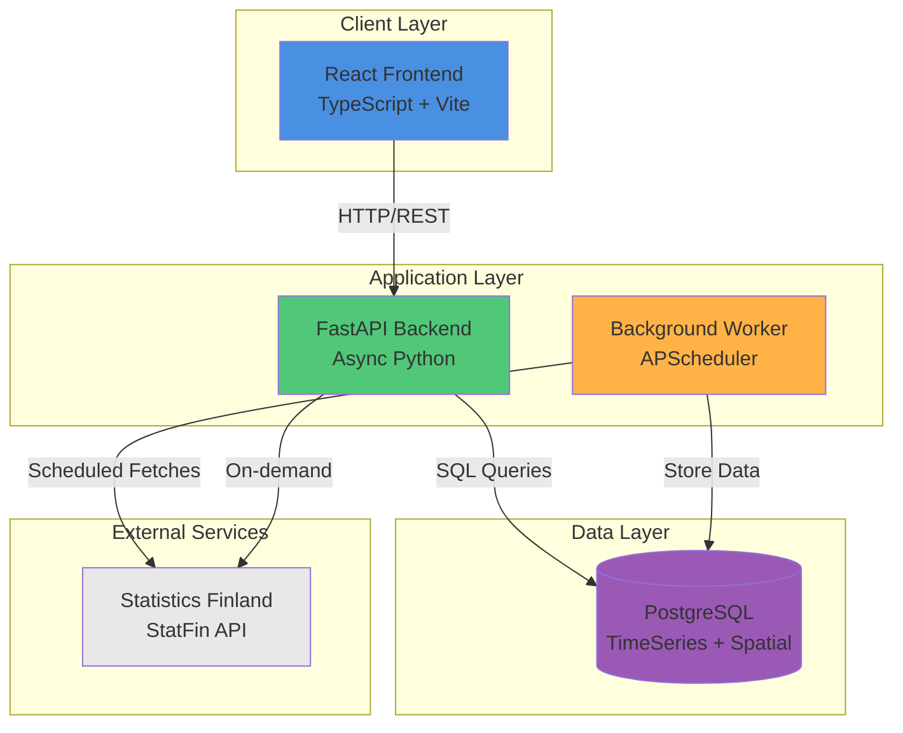
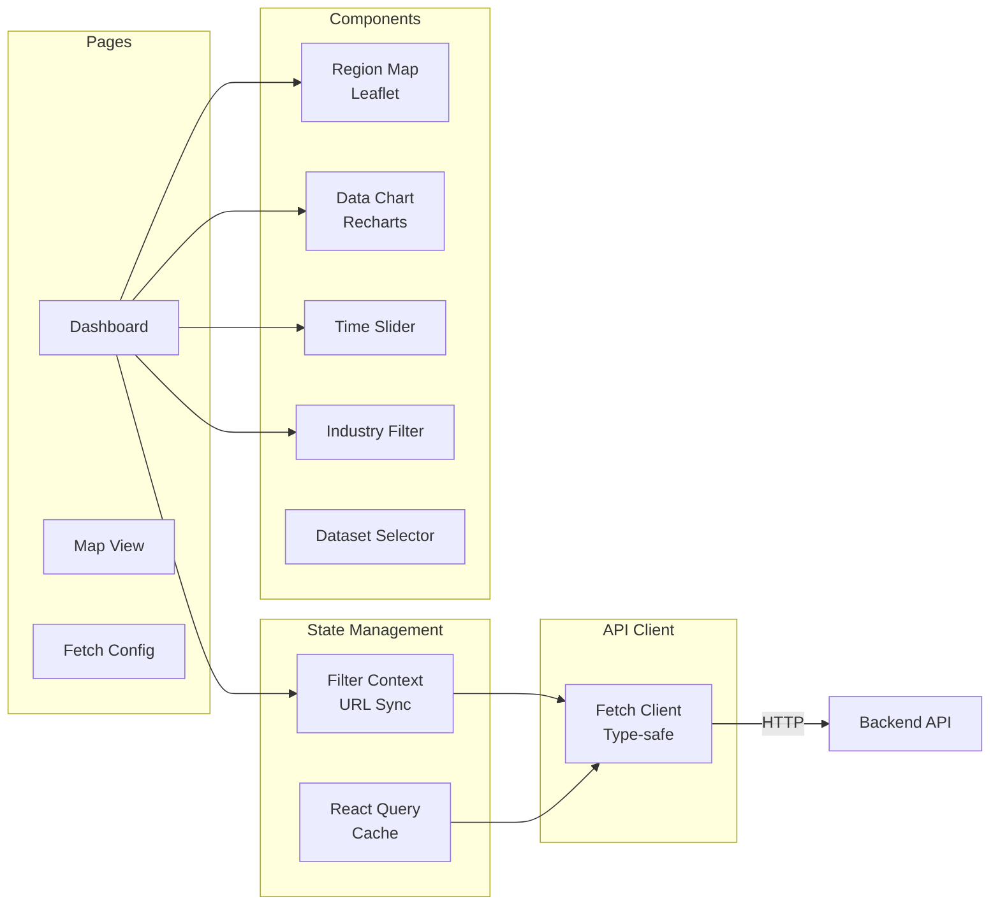
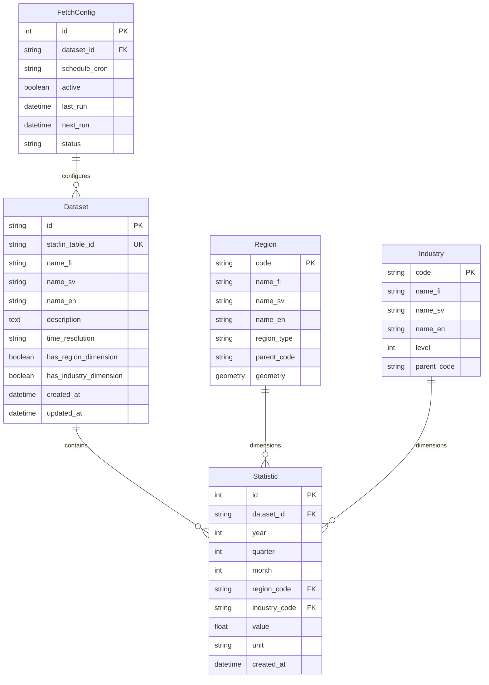
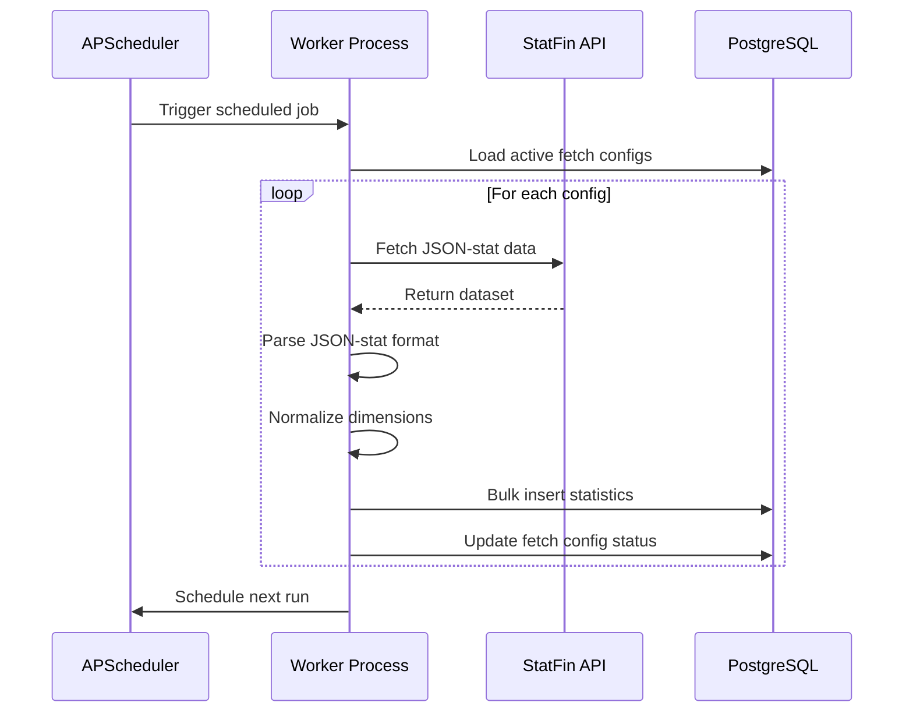
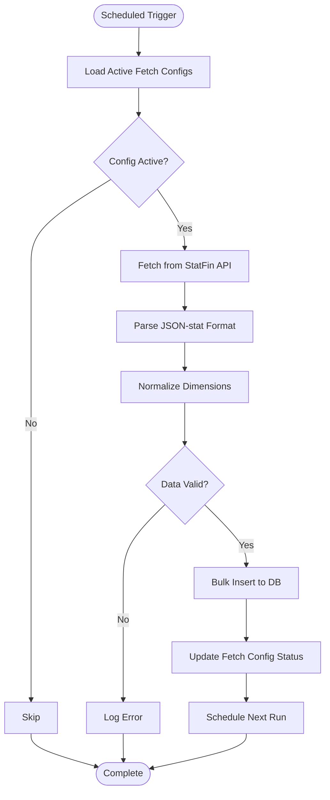
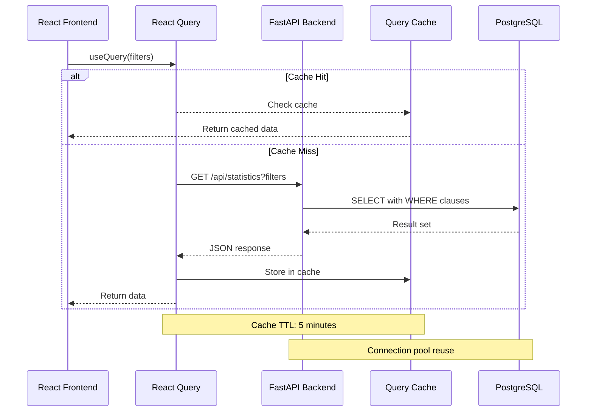
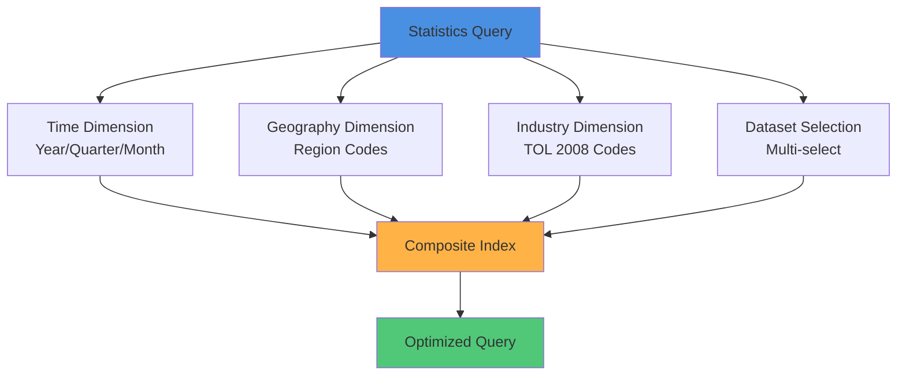
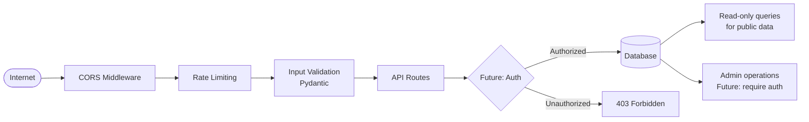
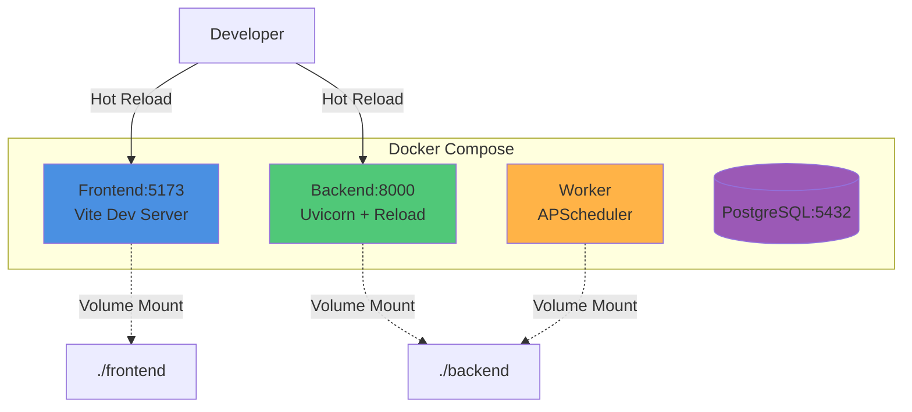
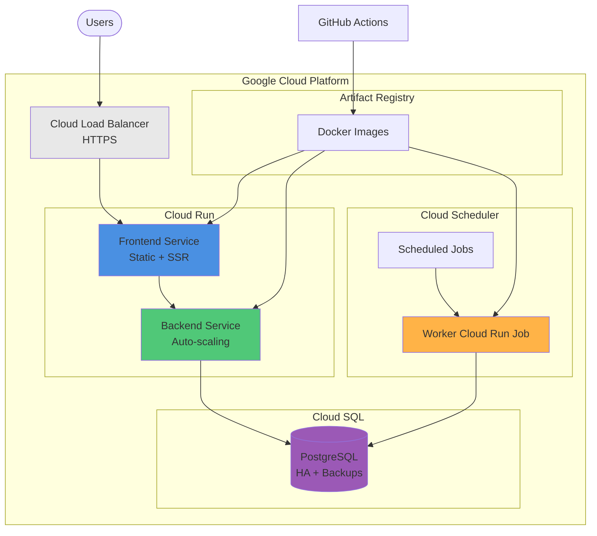

# Finnish Statistics Platform - Architecture

## Overview

The Finnish Statistics Platform is a full-stack web application for collecting, storing, and visualizing public statistics from Statistics Finland (StatFin). The platform enables multi-dimensional analysis of statistical data across time, geography, and industry dimensions.

## System Architecture



## Component Architecture

### Frontend (React + TypeScript)



**Key Technologies:**
- **React 18** - UI framework with hooks
- **TypeScript** - Type safety across the application
- **TanStack Query** - Server state management with caching
- **React Router 7** - Client-side routing with URL sync
- **Recharts** - Data visualization charts
- **Leaflet** - Interactive maps with GeoJSON
- **Vite** - Fast build tool and dev server

**Features:**
- URL-synchronized filter state (shareable links)
- Optimistic updates with React Query
- Parallel data fetching with `useQueries`
- Real-time filter updates across components
- Responsive design for mobile/desktop

### Backend (FastAPI + SQLAlchemy)

```mermaid
graph TB
    subgraph "API Routes"
        Statistics[/api/statistics<br/>Multi-dimensional queries]
        Datasets[/api/datasets<br/>CRUD operations]
        Dimensions[/api/dimensions<br/>Reference data]
        Fetch[/api/fetch<br/>Configuration]
        StatFinAPI[/api/statfin<br/>Proxy + browse]
    end

    subgraph "Services"
        StatFinClient[StatFin Client<br/>Async HTTP]
        Fetcher[Data Fetcher<br/>Orchestration]
        Normalizer[Data Normalizer<br/>JSON-stat parser]
    end

    subgraph "Models"
        Dataset[Dataset Model]
        Statistic[Statistic Model]
        Region[Region Model]
        Industry[Industry Model]
        FetchConfig[Fetch Config Model]
    end

    Statistics --> Statistic
    Datasets --> Dataset
    Dimensions --> Region
    Dimensions --> Industry
    Fetch --> FetchConfig
    StatFinAPI --> StatFinClient

    Fetcher --> StatFinClient
    Fetcher --> Normalizer
    Normalizer --> Statistic
```

**Key Technologies:**
- **FastAPI** - Modern async web framework
- **SQLAlchemy 2.0** - Async ORM with type hints
- **Pydantic** - Data validation and serialization
- **asyncpg** - Async PostgreSQL driver
- **httpx** - Async HTTP client for StatFin API
- **Alembic** - Database migrations

**Features:**
- Async request handling for high concurrency
- Connection pooling for database efficiency
- Comprehensive error handling with retries
- OpenAPI documentation at `/docs`
- CORS configured for frontend integration

### Database Schema



**Indexes:**
- **Composite Index** on `(dataset_id, year, quarter, month, region_code, industry_code)` for fast multi-dimensional queries
- **Individual Indexes** on `year`, `region_code`, `industry_code` for filtered queries
- **GiST Index** on `geometry` for spatial queries

### Background Worker



**Key Features:**
- **APScheduler** for cron-based scheduling
- Configurable fetch intervals (default: 24 hours)
- Automatic retry logic with exponential backoff
- Bulk inserts for performance
- Status tracking and error logging

## Data Flow

### Fetch Flow (Background)



### Query Flow (Frontend → Backend)



## Multi-Dimensional Query Model

The platform uses a consistent dimensional model for efficient cross-dataset queries:



**Benefits:**
- **Fast Queries**: Composite indexes enable sub-second queries even with millions of rows
- **Data Linkage**: Join statistics from different datasets by common dimensions
- **Flexible Filtering**: Filter by any combination of dimensions
- **Comparison**: Compare datasets side-by-side with aligned dimensions

## Security Architecture



**Current Security:**
- CORS configured for known origins
- Input validation via Pydantic schemas
- SQL injection prevention via SQLAlchemy ORM
- No authentication (public statistics only)

**Future Enhancements:**
- OAuth2 authentication for admin operations
- API keys for programmatic access
- Rate limiting per client
- Audit logging

## Deployment Architecture

### Local Development



### Production (GCP - Future)



## Performance Characteristics

| Component | Metric | Target | Notes |
|-----------|--------|--------|-------|
| Frontend Load | Initial Load | < 2s | With code splitting |
| API Response | P95 Latency | < 200ms | Simple queries |
| API Response | P95 Latency | < 1s | Complex multi-dataset |
| Database | Query Time | < 100ms | With indexes |
| Background Fetch | Processing | ~1000 rows/s | Bulk insert |
| React Query Cache | Hit Rate | > 80% | 5-minute TTL |

## Technology Stack Summary

| Layer | Technology | Version | Purpose |
|-------|-----------|---------|---------|
| Frontend | React | 18.x | UI framework |
| Frontend | TypeScript | 5.x | Type safety |
| Frontend | Vite | 5.x | Build tool |
| Frontend | TanStack Query | 5.x | Data fetching |
| Frontend | Recharts | 2.x | Charts |
| Frontend | Leaflet | 1.9.x | Maps |
| Backend | Python | 3.11+ | Runtime |
| Backend | FastAPI | 0.110+ | Web framework |
| Backend | SQLAlchemy | 2.0+ | ORM |
| Backend | Pydantic | 2.x | Validation |
| Backend | APScheduler | 3.x | Job scheduling |
| Database | PostgreSQL | 15+ | Data store |
| Database | PostGIS | (optional) | Spatial data |
| DevOps | Docker | 24+ | Containerization |
| DevOps | Docker Compose | 2.x | Orchestration |

## Next Steps

- See [DEPLOYMENT.md](./DEPLOYMENT.md) for deployment instructions
- See [EXTENDING-DATA-SOURCES.md](./EXTENDING-DATA-SOURCES.md) for adding new data sources
- See [API Documentation](http://localhost:8000/docs) when running locally
