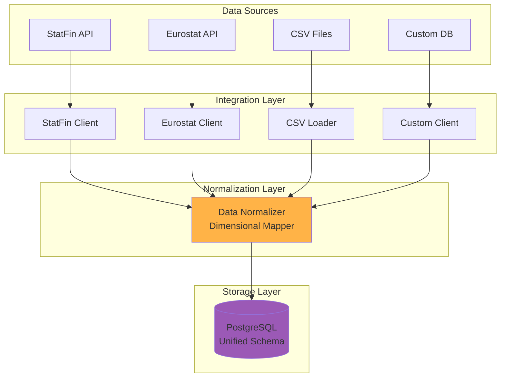
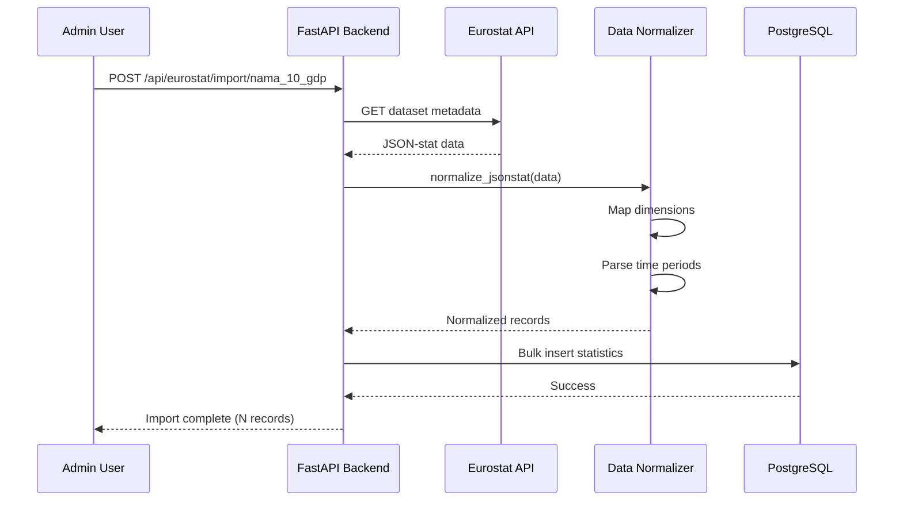

# Extending Data Sources

This guide explains how to add new data sources to the Finnish Statistics Platform beyond Statistics Finland (StatFin).

## Table of Contents

- [Overview](#overview)
- [Data Source Architecture](#data-source-architecture)
- [Adding a New Data Source](#adding-a-new-data-source)
- [Example: Eurostat Integration](#example-eurostat-integration)
- [Example: Custom CSV Import](#example-custom-csv-import)
- [Data Quality and Validation](#data-quality-and-validation)
- [Best Practices](#best-practices)

---

## Overview

The platform is designed to integrate multiple statistical data sources while maintaining a consistent dimensional model for cross-dataset analysis.

### Current Data Source

**Statistics Finland (StatFin)**
- Source: https://pxdata.stat.fi/PxWeb/api/v1/fi/StatFin
- Format: JSON-stat
- Coverage: Finnish national statistics
- Update frequency: Varies by dataset

### Potential Data Sources

| Source | Type | Coverage | Format | Complexity |
|--------|------|----------|--------|------------|
| Eurostat | API | European statistics | JSON-stat | Medium |
| OECD | API | International statistics | SDMX-JSON | High |
| World Bank | API | Development indicators | JSON | Low |
| Custom CSV | File | Organization data | CSV | Low |
| Custom Database | DB | Existing system | SQL | Medium |

---

## Data Source Architecture

### Abstraction Layers



### Key Principles

1. **Consistent Dimensions**: All data normalized to common dimension keys
2. **Source Metadata**: Track data provenance and update timestamps
3. **Flexible Schema**: Support varying dimensional structures
4. **Error Handling**: Robust retry and logging mechanisms
5. **Incremental Updates**: Fetch only new/changed data

---

## Adding a New Data Source

### Step 1: Define Data Source Client

Create a new client in `backend/services/`:

```python
# backend/services/eurostat.py

import httpx
from typing import Any, Dict, List
from config import get_settings

class EurostatClient:
    """Client for Eurostat API integration.

    Eurostat provides European statistics in JSON-stat format.
    API docs: https://ec.europa.eu/eurostat/web/json-and-unicode-web-services
    """

    def __init__(self):
        self.base_url = "https://ec.europa.eu/eurostat/api/dissemination/statistics/1.0"
        self.timeout = 30.0
        self.client = httpx.AsyncClient(timeout=self.timeout)

    async def list_datasets(self, lang: str = "en") -> List[Dict[str, Any]]:
        """List available Eurostat datasets.

        Args:
            lang: Language code (en, de, fr)

        Returns:
            List of dataset metadata dictionaries
        """
        url = f"{self.base_url}/data"
        params = {"lang": lang, "format": "JSON"}

        response = await self.client.get(url, params=params)
        response.raise_for_status()

        return response.json()

    async def fetch_dataset(
        self,
        dataset_code: str,
        filters: Dict[str, str] = None,
    ) -> Dict[str, Any]:
        """Fetch specific Eurostat dataset.

        Args:
            dataset_code: Eurostat dataset identifier
            filters: Optional dimension filters

        Returns:
            Dataset in JSON-stat format
        """
        url = f"{self.base_url}/data/{dataset_code}"
        params = {
            "format": "JSON",
            "lang": "en",
            **(filters or {}),
        }

        response = await self.client.get(url, params=params)
        response.raise_for_status()

        return response.json()

    async def close(self):
        """Close HTTP client connection."""
        await self.client.aclose()
```

### Step 2: Create Data Normalizer

Add normalization logic to convert source format to internal schema:

```python
# backend/services/eurostat_normalizer.py

from typing import Any, Dict, List
from models.statistics import Statistic

class EurostatNormalizer:
    """Normalize Eurostat JSON-stat to internal schema."""

    @staticmethod
    def dimension_mapping() -> Dict[str, str]:
        """Map Eurostat dimensions to internal dimension names.

        Returns:
            Dictionary mapping Eurostat codes to internal codes
        """
        return {
            "TIME_PERIOD": "time",
            "GEO": "region",
            "NACE_R2": "industry",
        }

    @staticmethod
    def normalize_jsonstat(
        data: Dict[str, Any],
        dataset_id: str,
    ) -> List[Dict[str, Any]]:
        """Convert Eurostat JSON-stat to Statistics records.

        Args:
            data: JSON-stat formatted data from Eurostat
            dataset_id: Internal dataset identifier

        Returns:
            List of normalized statistic dictionaries
        """
        statistics = []

        # Parse JSON-stat structure
        dimension_names = data["id"]
        dimension_sizes = data["size"]
        values = data["value"]

        # Map dimensions
        mapping = EurostatNormalizer.dimension_mapping()

        # Iterate through all data points
        for idx, value in enumerate(values):
            if value is None:
                continue

            # Calculate dimension indices
            coords = EurostatNormalizer._index_to_coords(
                idx, dimension_sizes
            )

            # Extract dimension values
            dimensions = {}
            for i, dim_name in enumerate(dimension_names):
                dim_code = data["dimension"][dim_name]["category"]["index"]
                dim_value = list(dim_code.keys())[coords[i]]

                internal_name = mapping.get(dim_name)
                if internal_name:
                    dimensions[internal_name] = dim_value

            # Parse time dimension
            time_str = dimensions.get("time", "")
            year, quarter, month = EurostatNormalizer._parse_time(time_str)

            # Create statistic record
            stat = {
                "dataset_id": dataset_id,
                "year": year,
                "quarter": quarter,
                "month": month,
                "region_code": dimensions.get("region"),
                "industry_code": dimensions.get("industry"),
                "value": float(value),
                "unit": data.get("extension", {}).get("unit", ""),
            }

            statistics.append(stat)

        return statistics

    @staticmethod
    def _parse_time(time_str: str) -> tuple[int, int | None, int | None]:
        """Parse Eurostat time format to year/quarter/month.

        Formats:
        - "2023" -> (2023, None, None)
        - "2023-Q1" -> (2023, 1, None)
        - "2023-M03" -> (2023, 1, 3)

        Args:
            time_str: Time dimension value

        Returns:
            Tuple of (year, quarter, month)
        """
        if "-Q" in time_str:
            year, quarter = time_str.split("-Q")
            return int(year), int(quarter), None
        elif "-M" in time_str:
            year, month_str = time_str.split("-M")
            month = int(month_str)
            quarter = (month - 1) // 3 + 1
            return int(year), quarter, month
        else:
            return int(time_str), None, None

    @staticmethod
    def _index_to_coords(index: int, sizes: List[int]) -> List[int]:
        """Convert flat index to multi-dimensional coordinates."""
        coords = []
        for size in reversed(sizes):
            coords.append(index % size)
            index //= size
        return list(reversed(coords))
```

### Step 3: Add API Routes

Create API endpoints for the new data source:

```python
# backend/api/routes/eurostat.py

from fastapi import APIRouter, Depends, HTTPException
from typing import List
from services.eurostat import EurostatClient
from services.eurostat_normalizer import EurostatNormalizer
from models.database import get_db
from sqlalchemy.ext.asyncio import AsyncSession

router = APIRouter(prefix="/api/eurostat", tags=["eurostat"])

@router.get("/datasets")
async def list_eurostat_datasets(lang: str = "en"):
    """List available Eurostat datasets.

    Args:
        lang: Language code (en, de, fr)

    Returns:
        List of dataset metadata
    """
    client = EurostatClient()
    try:
        datasets = await client.list_datasets(lang=lang)
        return {"datasets": datasets}
    finally:
        await client.close()

@router.post("/import/{dataset_code}")
async def import_eurostat_dataset(
    dataset_code: str,
    dataset_id: str,
    db: AsyncSession = Depends(get_db),
):
    """Import Eurostat dataset into internal database.

    Args:
        dataset_code: Eurostat dataset identifier
        dataset_id: Internal dataset ID to use
        db: Database session

    Returns:
        Import statistics
    """
    client = EurostatClient()

    try:
        # Fetch data from Eurostat
        data = await client.fetch_dataset(dataset_code)

        # Normalize to internal schema
        statistics = EurostatNormalizer.normalize_jsonstat(
            data, dataset_id
        )

        # Bulk insert (reuse existing logic)
        from services.fetcher import DataFetcher
        fetcher = DataFetcher(db)
        await fetcher.bulk_insert_statistics(statistics)

        return {
            "dataset_code": dataset_code,
            "dataset_id": dataset_id,
            "records_imported": len(statistics),
        }

    except Exception as e:
        raise HTTPException(
            status_code=500,
            detail=f"Failed to import dataset: {str(e)}"
        )

    finally:
        await client.close()
```

### Step 4: Register Routes

Add new router to main application:

```python
# backend/main.py

from api.routes import eurostat_router

app.include_router(eurostat_router)
```

### Step 5: Update Database Schema (if needed)

If new dimensions are required, add them to the schema:

```python
# backend/alembic/versions/XXXX_add_eurostat_dimensions.py

def upgrade():
    # Add new dimension if needed
    op.add_column('statistics',
        sa.Column('eurostat_geo_code', sa.String(10), nullable=True)
    )

    # Add index
    op.create_index(
        'ix_statistics_eurostat_geo',
        'statistics',
        ['eurostat_geo_code']
    )

def downgrade():
    op.drop_index('ix_statistics_eurostat_geo', 'statistics')
    op.drop_column('statistics', 'eurostat_geo_code')
```

### Step 6: Add Tests

```python
# backend/tests/test_eurostat.py

import pytest
from services.eurostat import EurostatClient
from services.eurostat_normalizer import EurostatNormalizer

@pytest.mark.asyncio
async def test_list_datasets():
    client = EurostatClient()
    datasets = await client.list_datasets()
    assert len(datasets) > 0
    await client.close()

@pytest.mark.asyncio
async def test_fetch_dataset():
    client = EurostatClient()
    data = await client.fetch_dataset("nama_10_gdp")
    assert "value" in data
    assert "dimension" in data
    await client.close()

def test_normalize_jsonstat():
    # Mock JSON-stat data
    data = {
        "id": ["TIME_PERIOD", "GEO"],
        "size": [2, 2],
        "value": [100, 110, 200, 220],
        "dimension": {
            "TIME_PERIOD": {
                "category": {"index": {"2022": 0, "2023": 1}}
            },
            "GEO": {
                "category": {"index": {"FI": 0, "SE": 1}}
            },
        },
    }

    statistics = EurostatNormalizer.normalize_jsonstat(data, "test_dataset")

    assert len(statistics) == 4
    assert statistics[0]["year"] == 2022
    assert statistics[0]["region_code"] == "FI"
    assert statistics[0]["value"] == 100.0
```

---

## Example: Eurostat Integration

### Complete Integration Flow



### Configuration

Add to `.env`:

```bash
# Eurostat Configuration
EUROSTAT_BASE_URL=https://ec.europa.eu/eurostat/api/dissemination/statistics/1.0
EUROSTAT_LANG=en
```

### Usage Example

```bash
# List available datasets
curl http://localhost:8000/api/eurostat/datasets

# Import specific dataset
curl -X POST http://localhost:8000/api/eurostat/import/nama_10_gdp \
  -H "Content-Type: application/json" \
  -d '{"dataset_id": "eurostat_gdp"}'

# Query imported data
curl http://localhost:8000/api/statistics?dataset_id=eurostat_gdp&year=2023
```

---

## Example: Custom CSV Import

### Use Case

Import organization-specific data from CSV files:

```csv
year,quarter,region,industry,value,unit
2023,1,FI-19,A01,1500000,EUR
2023,1,FI-19,A02,2300000,EUR
2023,2,FI-19,A01,1650000,EUR
```

### Implementation

```python
# backend/services/csv_importer.py

import csv
from typing import List, Dict, Any
from io import StringIO

class CSVImporter:
    """Import statistics from CSV files."""

    @staticmethod
    def parse_csv(
        file_content: str,
        dataset_id: str,
        column_mapping: Dict[str, str] = None,
    ) -> List[Dict[str, Any]]:
        """Parse CSV and convert to internal format.

        Args:
            file_content: CSV file content as string
            dataset_id: Internal dataset identifier
            column_mapping: Map CSV columns to internal fields

        Returns:
            List of normalized statistics
        """
        # Default column mapping
        if column_mapping is None:
            column_mapping = {
                "year": "year",
                "quarter": "quarter",
                "month": "month",
                "region": "region_code",
                "industry": "industry_code",
                "value": "value",
                "unit": "unit",
            }

        statistics = []
        reader = csv.DictReader(StringIO(file_content))

        for row in reader:
            stat = {
                "dataset_id": dataset_id,
            }

            # Map columns
            for csv_col, internal_col in column_mapping.items():
                if csv_col in row:
                    value = row[csv_col]

                    # Type conversion
                    if internal_col in ["year", "quarter", "month"]:
                        stat[internal_col] = int(value) if value else None
                    elif internal_col == "value":
                        stat[internal_col] = float(value)
                    else:
                        stat[internal_col] = value

            statistics.append(stat)

        return statistics

# API endpoint
from fastapi import UploadFile

@router.post("/api/csv/import")
async def import_csv(
    file: UploadFile,
    dataset_id: str,
    db: AsyncSession = Depends(get_db),
):
    """Import CSV file."""
    content = await file.read()

    statistics = CSVImporter.parse_csv(
        content.decode("utf-8"),
        dataset_id,
    )

    # Bulk insert
    from services.fetcher import DataFetcher
    fetcher = DataFetcher(db)
    await fetcher.bulk_insert_statistics(statistics)

    return {
        "filename": file.filename,
        "records_imported": len(statistics),
    }
```

---

## Data Quality and Validation

### Validation Rules

```python
# backend/services/validators.py

from pydantic import BaseModel, validator
from typing import Optional

class StatisticValidator(BaseModel):
    """Validate statistics before insertion."""

    dataset_id: str
    year: int
    quarter: Optional[int] = None
    month: Optional[int] = None
    region_code: Optional[str] = None
    industry_code: Optional[str] = None
    value: float
    unit: str

    @validator("year")
    def year_range(cls, v):
        if v < 1900 or v > 2100:
            raise ValueError("Year must be between 1900 and 2100")
        return v

    @validator("quarter")
    def quarter_range(cls, v):
        if v is not None and (v < 1 or v > 4):
            raise ValueError("Quarter must be between 1 and 4")
        return v

    @validator("month")
    def month_range(cls, v):
        if v is not None and (v < 1 or v > 12):
            raise ValueError("Month must be between 1 and 12")
        return v

    @validator("value")
    def value_finite(cls, v):
        if not (-1e15 < v < 1e15):
            raise ValueError("Value out of reasonable range")
        return v
```

### Data Quality Checks

```python
# backend/services/quality_checks.py

from sqlalchemy import select, func
from models.statistics import Statistic

class QualityChecker:
    """Run data quality checks after import."""

    @staticmethod
    async def check_completeness(
        db: AsyncSession,
        dataset_id: str,
    ) -> Dict[str, Any]:
        """Check for missing dimension values."""
        # Check for null dimensions
        query = select(
            func.count(Statistic.id).label("total"),
            func.count(Statistic.region_code).label("with_region"),
            func.count(Statistic.industry_code).label("with_industry"),
        ).where(Statistic.dataset_id == dataset_id)

        result = await db.execute(query)
        row = result.first()

        return {
            "total_records": row.total,
            "region_coverage": row.with_region / row.total if row.total > 0 else 0,
            "industry_coverage": row.with_industry / row.total if row.total > 0 else 0,
        }

    @staticmethod
    async def check_outliers(
        db: AsyncSession,
        dataset_id: str,
    ) -> List[Dict[str, Any]]:
        """Identify statistical outliers."""
        # Calculate mean and stddev
        query = select(
            func.avg(Statistic.value).label("mean"),
            func.stddev(Statistic.value).label("stddev"),
        ).where(Statistic.dataset_id == dataset_id)

        result = await db.execute(query)
        stats = result.first()

        # Find outliers (> 3 stddev from mean)
        threshold = 3
        lower = stats.mean - (threshold * stats.stddev)
        upper = stats.mean + (threshold * stats.stddev)

        outlier_query = select(Statistic).where(
            Statistic.dataset_id == dataset_id,
            (Statistic.value < lower) | (Statistic.value > upper),
        ).limit(100)

        outliers = await db.execute(outlier_query)

        return [
            {
                "year": o.year,
                "value": o.value,
                "deviation": abs(o.value - stats.mean) / stats.stddev,
            }
            for o in outliers.scalars()
        ]
```

---

## Best Practices

### 1. Dimension Consistency

**Always map to standard dimensions:**

```python
STANDARD_DIMENSIONS = {
    "time": ["year", "quarter", "month"],
    "geography": ["region_code"],
    "industry": ["industry_code"],
}
```

**Create lookup tables for dimension codes:**

```python
# Map Eurostat region codes to internal codes
REGION_CODE_MAPPING = {
    "FI": "FI-ALL",  # Finland
    "FI1": "FI-19",  # Helsinki-Uusimaa
    # ...
}
```

### 2. Incremental Updates

**Track last update timestamp:**

```python
class Dataset(Base):
    last_fetch_at: Mapped[datetime] = mapped_column(DateTime)
    last_fetch_status: Mapped[str] = mapped_column(String(50))

# Only fetch new data
if dataset.last_fetch_at:
    filters["since"] = dataset.last_fetch_at.isoformat()
```

### 3. Error Handling

**Implement retry logic with exponential backoff:**

```python
import asyncio
from tenacity import retry, stop_after_attempt, wait_exponential

@retry(
    stop=stop_after_attempt(3),
    wait=wait_exponential(multiplier=1, min=4, max=10),
)
async def fetch_with_retry(url: str):
    response = await client.get(url)
    response.raise_for_status()
    return response.json()
```

### 4. Logging

**Log all integration activity:**

```python
import logging

logger = logging.getLogger(__name__)

logger.info(f"Fetching dataset {dataset_code} from Eurostat")
logger.debug(f"Request URL: {url}")
logger.warning(f"Incomplete data: {missing_count} records missing dimensions")
logger.error(f"Failed to fetch dataset: {e}")
```

### 5. Documentation

**Document each data source:**

```markdown
## Data Source: Eurostat

- **URL**: https://ec.europa.eu/eurostat/
- **Coverage**: European Union statistics
- **Update Frequency**: Quarterly
- **API Documentation**: https://ec.europa.eu/eurostat/web/json-and-unicode-web-services
- **Dimensions Supported**: time, geography, industry
- **Known Limitations**:
  - Regional data limited to NUTS regions
  - Historical data availability varies by dataset
```

---

## Next Steps

1. Review [ARCHITECTURE.md](./ARCHITECTURE.md) for system design
2. See [DEPLOYMENT.md](./DEPLOYMENT.md) for environment setup
3. Implement a data source following this guide
4. Add comprehensive tests for new integrations
5. Document dimension mappings and data quality metrics
